## List of supported features

Since the main audience of the Lama language is students, here is described what the plugin can do. If you are familiar
with the IntelliJ IDEA, you are unlikely to be interested in this list

- **Code Highlighting**

  Also in Lama no syntax difference between common comments and documentation comments, but plugin tries to distinguish
  it and highlight documentation in another way
    
  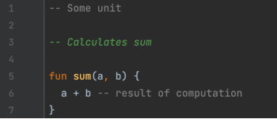

- **Exception Highlighting**

  And navigation to source!  
    
  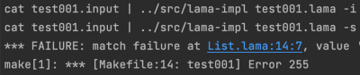

- **Code Formatter**

  `ctrl+alt+l` - reformat your code. Result depends on many setting which you can change
  in `Preferences > Editor > Code Style > Lama`
    
  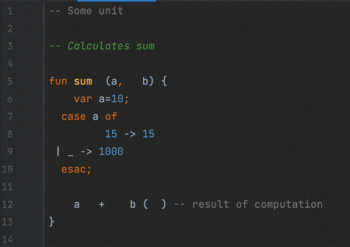

- **Typing helpers**

  During typing plugin puts double quotes and brackets for you, sets indents etc.
    
  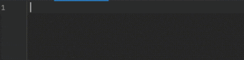

- **Commenter**

  Use `ctrl+/` to comment/uncomment current/selected lines. Use `ctrl+shift+/` to make block comment
    
  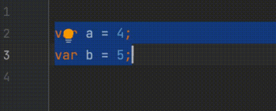

- **Completion**

  On typing or by `ctrl+space` action IDE shows you completion of current statement - global and local functions,
  variables pattern names
    
  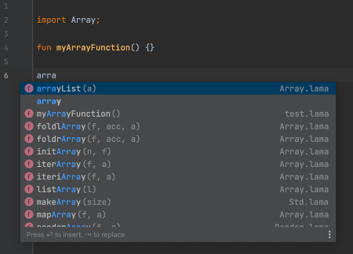

- **Live Templates**

  Also in completion list there are some predefined templates for `case`, `if`, `while`, `for`, `fun` statements, since
  they are not very convenient to write with your hands
    
  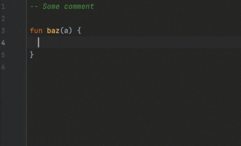

- **Go To Declaration/Find Usages**

  Use `ctrl+b` or `ctrl+click` on symbol usage to jump to declaration. Use `ctrl+u` on declaration to show usages of
  symbol. Should works fine on all symbol types except S-expressions: global and local functions, variables, custom
  infix, pattern variables. S-expressions not supported because they don't have definitions
    
  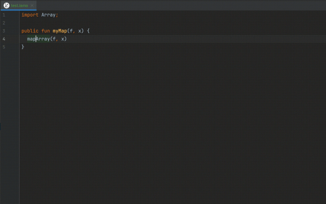

- **Rename**

  All symbols above can be also renamed. Use `ctrl+shift+f6`
    
  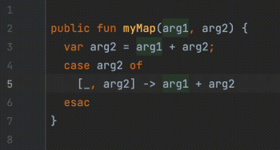

- **Parameter info**

  Call `ctrl+p` inside argument list to show function arguments and on which you currently are. Should works fine with
  dot calls
    
  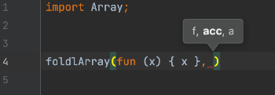

- **Inspections**

  Plugin provide some simple inspections: warn if you made a typo in symbol name, pass wrong argument count into
  function, forgot a semicolon between expressions, forgot to import a unit. Also, it suggests a fix problem for you -
  add semicolon, add an import statement.

  Any inspection can be disabled. See `Preferences > Editor > Inspections > Lama`
    
  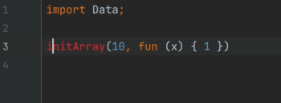